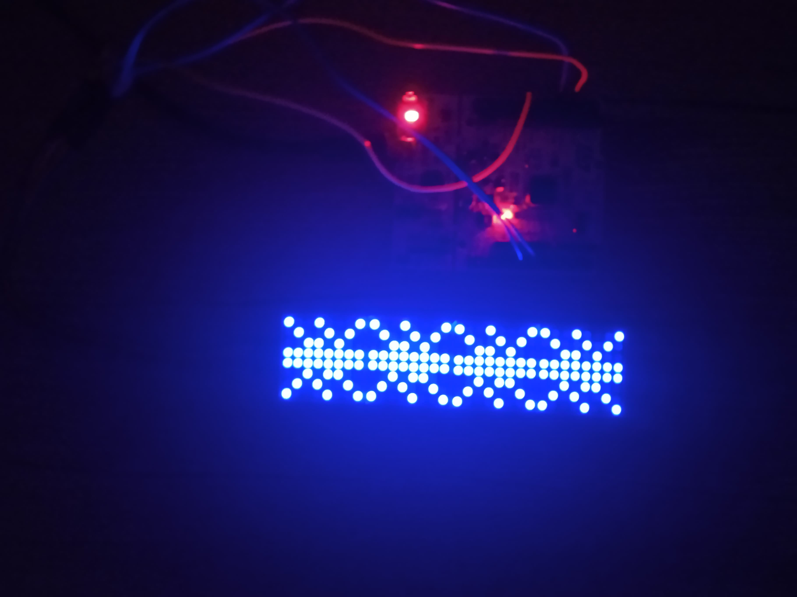

# stm32f103rb-max7219-lib
Small C library to operate on MAX7219 device. Library can be found in lib dir and is only 2.5Kb in size. No libc dependencies was used apart from <stdint.h>. 
Example of how to use library is shown in Makefile and main.c.

